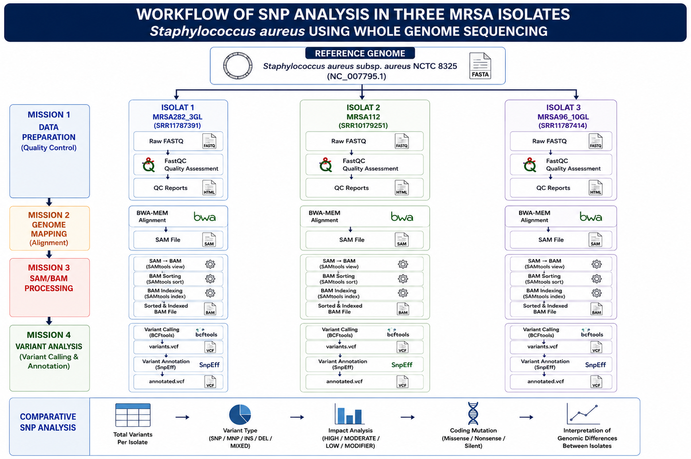

# 🧬 Comparative SNP Analysis of Three Methicillin-Resistant *Staphylococcus aureus* (MRSA) Isolates Using Whole Genome Sequencing

---

## 📖 Project Overview

This project investigates genomic variation among three Methicillin-Resistant *Staphylococcus aureus* (MRSA) isolates using a Whole Genome Sequencing (WGS) workflow. A reference based variant calling approach was performed to identify and compare Single Nucleotide Polymorphisms (SNPs), functional variant impacts, coding region mutations, and missense to silent mutation ratios.

The analysis pipeline includes:

- Quality assessment (FastQC & Fastp)
- Genome alignment (BWA-MEM)
- BAM processing (SAMtools)
- Variant calling (BCFtools)
- Variant annotation (SnpEff)
- Comparative SNP analysis

Reference genome:

> *Staphylococcus aureus* subsp. *aureus* NCTC 8325 (NC_007795.1)

---

## 🎯 Research Objective

To characterize genomic diversity among three MRSA isolates through comparative SNP analysis and evaluate the functional impact of genomic variants relative to the NCTC 8325 reference genome.

---

## 🦠 Dataset

### Reference Genome

| Feature | Description |
|----------|-------------|
| Organism | *Staphylococcus aureus* subsp. *aureus* |
| Strain | NCTC 8325 |
| RefSeq | NC_007795.1 |
| Assembly | GCF_000013425.1 |

### MRSA Isolates

| Isolate | SRA Accession |
|----------|----------|
| MRSA282_3GL | SRR11787391 |
| MRSA112 | SRR10179251 |
| MRSA96_10GL | SRR11787414 |

---

## 🔬 Workflow



---

## 🛠 Tools and Software

| Tool | Purpose |
|---------|---------|
| FastQC | Quality assessment |
| Fastp | Read filtering and trimming |
| BWA-MEM | Genome alignment |
| SAMtools | BAM processing |
| BCFtools | Variant calling |
| SnpEff | Variant annotation |
| Linux | Workflow execution |

---

## 📊 Fastp Quality Control Comparison

| Parameter | MRSA282_3GL (SRR11787391) | MRSA112 (SRR10179251) | MRSA96_10GL (SRR11787414) |
|------------|------------:|------------:|------------:|
| Total Reads (Before Filtering) | 4.273 M | 3.676 M | 4.039 M |
| Total Reads (After Filtering) | 4.248 M | 3.633 M | 4.016 M |
| Reads Passed Filters (%) | 99.41 | 98.81 | 99.42 |
| Q20 Before (%) | 96.99 | 97.57 | 97.03 |
| Q30 Before (%) | 91.72 | 94.19 | 91.82 |
| Q20 After (%) | 97.17 | 97.93 | 97.21 |
| Q30 After (%) | 91.96 | 94.72 | 92.06 |
| GC Content Before (%) | 32.69 | 32.74 | 32.85 |
| GC Content After (%) | 32.58 | 32.64 | 32.77 |
| Duplication Rate (%) | 4.82 | 5.32 | 5.26 |
| Insert Size Peak (bp) | 271 | 259 | 271 |

### Key Findings

✅ All three MRSA isolates exhibited excellent sequencing quality, with more than 98.8% of reads passing filtering criteria, indicating minimal contamination and a low proportion of poor quality reads.

✅ MRSA282_3GL generated the largest sequencing dataset, containing 4.273 million reads before filtering and 4.248 million reads after filtering, providing the highest sequencing depth among the isolates.

✅ MRSA112 demonstrated the best overall read quality, with the highest Q30 score before filtering (94.19%) and after filtering (94.72%), indicating the lowest sequencing error rate and highest base calling accuracy.

✅ Quality filtering improved read quality in all isolates, as evidenced by increases in both Q20 and Q30 scores after Fastp processing.

✅ GC content was highly consistent across all isolates (32.58–32.77% after filtering) and closely matched the expected GC content of Staphylococcus aureus, suggesting the absence of significant contamination from other organisms.

✅ Duplication rates were low (4.82–5.32%) in all datasets, indicating high library complexity and reducing the likelihood of biases during alignment and variant calling.

✅ The insert size distribution was highly consistent, with peak insert sizes ranging from 259 bp to 271 bp, reflecting successful paired end library preparation and sequencing.

---

## 📈 Comparative Variant Analysis

### Total Variants

| Isolate | Total Variants |
|----------|----------:|
| MRSA282_3GL | 3561 |
| MRSA112 | 3710 |
| MRSA96_10GL | 3544 |

---

### Variant Type Distribution

| Variant Type | MRSA282_3GL | MRSA112 | MRSA96_10GL |
|--------------|------------:|---------:|------------:|
| SNP | 2706 | 2861 | 2692 |
| MNP | 696 | 680 | 704 |
| Insertion | 39 | 45 | 39 |
| Deletion | 86 | 87 | 77 |
| Mixed | 34 | 37 | 32 |

---

### Functional Impact Categories

| Impact | MRSA282_3GL | MRSA112 | MRSA96_10GL |
|---------|---------:|---------:|---------:|
| High | 58 | 94 | 61 |
| Moderate | 1080 | 1228 | 1082 |
| Low | 1844 | 1746 | 1827 |
| Modifier | 44646 | 46256 | 44421 |

---

### Coding Region Mutations

| Mutation Type | MRSA282_3GL | MRSA112 | MRSA96_10GL |
|---------------|------------:|---------:|------------:|
| Missense | 720 | 888 | 722 |
| Nonsense | 7 | 22 | 8 |
| Silent | 1580 | 1502 | 1561 |

---

### Missense to Silent Mutation Ratio

| Isolate | Missense/Silent Ratio |
|----------|----------:|
| MRSA282_3GL | 0.456 |
| MRSA112 | 0.591 |
| MRSA96_10GL | 0.463 |

---

## 🔍 Biological Interpretation

Comparative whole genome SNP analysis revealed considerable genomic diversity among the three MRSA isolates relative to the *Staphylococcus aureus* NCTC 8325 reference genome.

Among the analyzed isolates, **MRSA112** displayed:

- The highest total number of variants (3,710)
- The highest SNP count (2,861)
- The highest number of missense mutations (888)
- The highest number of nonsense mutations (22)
- The highest number of high impact variants (94)

These findings indicate that MRSA112 is the most genetically divergent isolate relative to the NCTC 8325 reference genome.

The predominance of modifier impact variants suggests that most mutations are located within non coding or regulatory regions of the genome. Although such variants may not directly alter protein sequences, they can contribute to differences in gene regulation and genomic architecture.

Furthermore, MRSA112 displayed the highest missense to silent mutation ratio (0.591), indicating a greater proportion of amino acid altering substitutions compared with the other isolates. This observation suggests increased coding sequence variability and a higher potential for functional diversification at the protein level.

---

## 📁 Repository Structure

```text
mrsa-wgs-snp-analysis/
│
├── README.md
│
├── reference_genome/
│
├── qc/
│   ├── MRSA282_3GL/
│   ├── MRSA112/
│   └── MRSA96_10GL/
│ 
├── variants/
│   ├── MRSA282_3GL/
│   ├── MRSA112/
│   └── MRSA96_10GL/
│
├── comparative_analysis/
│   ├── figures/
│   └── table/
│
└── docs/
    ├── workflow.png
    └── infografis.png
```

---

## 💡 Skills Demonstrated

- Whole Genome Sequencing (WGS)
- Linux Command Line
- FastQC & Fastp
- Genome Alignment
- SAMtools
- BCFtools
- SnpEff
- Variant Calling
- Comparative Genomics
- Data Visualization
- Bioinformatics Workflow Development

---

## 📂 Data Availability

Raw sequencing files are not included in this repository due to GitHub file size limitations.

The datasets are publicly available through NCBI SRA:

- SRR11787391 (MRSA282_3GL)
- SRR10179251 (MRSA112)
- SRR11787414 (MRSA96_10GL)

Reference genome:

- GCF_000013425.1 (*S. aureus* NCTC 8325)

---

## 👩‍🔬 Author

**Raysha Tryfhatya Nurhaidha**

Biology Graduate  
Interest: Molecular Biology • Bioinformatics • Microbiology

Linkedln: `linkedin.com/in/rayshatn`

GitHub: `github.com/rayshatn`

Email: `rayshatryfhatya@gmail.com`

---
